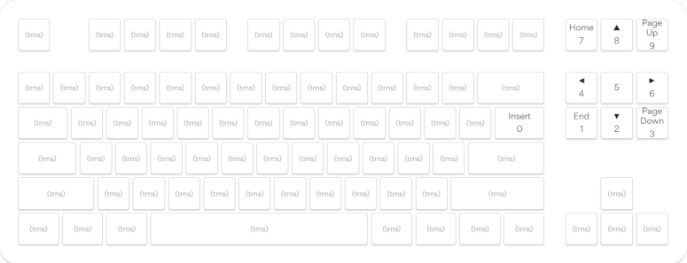

# massdrop-ctrl-keymap

This repo is for keeping track of the changes I make to the firmware running on my Massdrop CTRL keyboard.

## Keyboard Features

### Numpad

A numpad layer is activated by holding down grave mark (tilde) key. The numpad is located on the upper right of the
keyboard like so:

While the numpad layer is active, the numpad keys are backlit with cyan LEDs.

### Spanish Language Support

The Spanish layer can be turned on and off by double tapping `LEFT ALT`. While the Spanish layer is active, the
`LEFT ALT` key will be backlit with a cyan LED. The Spanish layer is automatically turned off after typing a 
Spanish letter.

#### Letters with Accents

While the Spanish layer is active, type the corresponding letter. For example, pressing `a` will produce `á`,
`e` will produce `é`, `n` will produce `ñ` and so on. To get capital letters, hold `SHIFT` at the same time as
pressing the corresponding letter.

#### Inverted Punctuation Marks

For `¡` and `¿`,  use `SHIFT`+`1` and `SHIFT`+`/`, respectively.

Note that `SHIFT`+`1` is `!` and `SHIFT`+`/` is `?`, so effectively, you could also think of these as
just pressing `!` and `?`, while the Spanish layer is active.

## Compiling

This firmware cannot be compiled with the official [qmk_firmware](https://github.com/qmk/qmk_firmware), but instead 
needs to be compiled using [Massdrop's fork](https://github.com/Massdrop/qmk_firmware) of the QMK repo. 
Specifically, using the [feature/riot_xap](https://github.com/Massdrop/qmk_firmware/tree/feature/riot_xap) branch.

### Windows

I wasn't able to compile this using [QMK MSYS](https://msys.qmk.fm/). When I tried, I got an error stating that
Massdrop's fork of qmk_firmware "exists but is not a qmk_firmware clone!"

So instead, I used [MSYS2](https://www.msys2.org/) and followed the instructions for 
"[Building a keyboard firmware](https://matt3o.com/building-a-keyboard-firmware/)" on Matt3o.com. 
Specifically, the instructions for setting up MSYS2 and downloading QMK. 

Notes:
* The git clone will be `git clone -b feature/riot_xap https://github.com/Massdrop/qmk_firmware` instead of 
  `git clone https://github.com/qmk/qmk_firmware`.
* I had to run `pacman -S $MINGW_PACKAGE_PREFIX-python-pip` before I could run `make git-submodule`.

Next copy all the files from the `qmk_firmware/keyboards/massdrop/ctrl/jgmortim` directory in this repo and place
them into the `qmk_firmware/keyboards/massdrop/ctrl/jgmortim` directory of the repo you cloned.

You can then use MSYS2 to compile this keymap using `qmk compile -kb massdrop/ctrl -km jgmortim`.

### Other OS

I'm currently only using Windows 10, so if you try to use this on Linux or Mac, you'll be figuring that out on your own.

## Flashing

Once you have your .bin, you can flash it using [mdloader](https://github.com/Massdrop/mdloader).
Use the command `mdloader --first --download massdrop_ctrl_jgmortim.bin --restart`.

## See Also

* [The QMK Tutorial](https://docs.qmk.fm/newbs)
  * [Setting Up Your QMK Environment](https://docs.qmk.fm/newbs_getting_started)
  * [Building Your First Firmware](https://docs.qmk.fm/newbs_building_firmware)
  * [Flashing Your Keyboard](https://docs.qmk.fm/newbs_flashing)

## Contact

jgmortim

## Credits

LED config code was mostly transferred from [matthewrobo keymap](https://github.com/qmk/qmk_firmware/tree/master/keyboards/massdrop/ctrl/keymaps/matthewrobo).