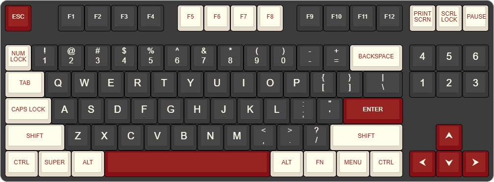
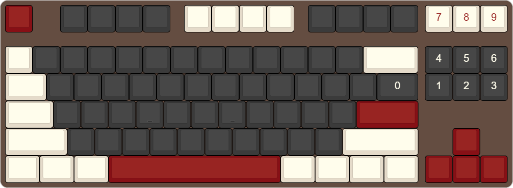

# massdrop-ctrl-keymap

This repo is for keeping track of the changes I make to the firmware running on my Massdrop CTRL keyboard as well as
all other aspects of the keyboard.

An approximate rendering of my keyboard is below:

Click to expand image

## Hardware

[Drop CTRL V1 High-Profile](https://drop.com/buy/drop-ctrl-high-profile-mechanical-keyboard) TKL Mechanical Keyboard
* Case: [Bronze Replacement Case](https://drop.com/buy/drop-ctrl-high-profile-aluminum-case?defaultSelectionIds=966025)
* PCB: Stock CTRL V1
* LED Diffuser: Stock [CTRL LED Diffuser](https://drop.com/buy/drop-mechanical-keyboard-led-diffusers?defaultSelectionIds=989038)
* Switches: [Halo Clear](https://drop.com/buy/drop-halo-switch-pack?defaultSelectionIds=986078)
* Stabilizers: Stock Plate-mounted Cherry-style
* Keycaps: [KeyGeak Rome PBT - SA profile](https://keygeak.com/products/rome-pbt-ansi-iso-keycaps-set-sa-profile)
* Foam: [StupidFish Designs](https://stupidfish.design/products/drop-ctrl-high-profile-case-and-plate-foam-set)

## OS Modes

The keyboard contains both a Windows mode and a Linux mode. The default mode is Windows. To ensure that all keyboard
functions work property, make sure the keyboard is in the correct mode for the current OS.

To toggle modes, press <kbd>fn</kbd>+<kbd>Win</kbd>. While holding down the <kbd>fn</kbd> key (i.e., the Function
layer is active), the <kbd>Win</kbd> key will be backlit turquoise 
if Windows mode is active and purple  if Linux mode is active.
After switching modes, the <kbd>Win</kbd> key will remain backlight for 3 seconds on all layers (in addition to always
being backlit on the Function layer).

## Layers

### L0 \ Base

The base, or default, layer is a pretty standard QWERTY layout. A few of the key caps are different, as shown in the
render above, but the layout works as one would expect.

### L1 \ Function

Holding down the <kbd>fn</kbd> key activates the function layer, which features functions brought in from the
default keymap as well as an additional OS toggle function:

| Key | Function                                                                           |
|-----|------------------------------------------------------------------------------------|
| B   | Put the keyboard into DFU (Device Firmware Update) mode after hold timeout (500ms) |
| I   | USB Toggle Automatic GCR control                                                   |
| N   | Toggle keyboard 6KRO/NKRO (Default state 6KRO)                                     |
| U   | USB Extra Port Toggle Auto Detect                                                  |
| Win | Toggle OS mode between Windows and Linus (Default state Windows)                   |

### L2 \ Numpad

A numpad layer can be turned on and off by double tapping the grave mark (tilde) key (which is using the
<kbd>Num Lock</kbd> key cap on my keyboard) while on any other layer. The numpad is located on the upper right of the
keyboard like so:

Click to expand image

While the numpad layer is active, the numpad keys are backlit with copper
 LEDs. All other keys are transparent.

### L3 \ Spanish

The Spanish layer can be turned on and off by double tapping <kbd>Left Alt</kbd> while on any other layer. While the
Spanish layer is active, the <kbd>Left Alt</kbd> key will be backlit with a cyan
 LED. The Spanish layer is automatically turned off after typing a
Spanish letter or punctuation mark. All keys other than <kbd>A</kbd>, <kbd>E</kbd>, <kbd>I</kbd>, <kbd>O</kbd>,
<kbd>U</kbd>, <kbd>N</kbd>, <kbd>?</kbd>, and <kbd>!</kbd> are transparent.

Click to expand image

#### Letters with Accents

While the Spanish layer is active, type the corresponding letter to get an accented letter. For example, pressing
<kbd>a</kbd> will produce <kbd>á</kbd>, <kbd>e</kbd> will produce <kbd>é</kbd>, <kbd>n</kbd> will produce <kbd>ñ</kbd>
and so on. To get capital letters, either use <kbd>Caps Lock</kbd> or hold <kbd>Shift</kbd> at the same time as
pressing the corresponding letter.

#### Inverted Punctuation Marks

For <kbd>¡</kbd> and <kbd>¿</kbd>, use <kbd>Shift</kbd>+<kbd>1</kbd> and <kbd>Shift</kbd>+<kbd>/</kbd>, respectively.

Note that <kbd>Shift</kbd>+<kbd>1</kbd> is normally <kbd>!</kbd> and <kbd>Shift</kbd>+<kbd>/</kbd> is normally
<kbd>?</kbd>. So effectively, you could also think of these as just pressing <kbd>!</kbd> and <kbd>?</kbd>, while the
Spanish layer is active.

## Other Features

### LED Timeout

After 5 minutes of inactivity, the LEDs will turn off. Pressing any key will turn them back on.

### Custom Shortcuts

| OS      | Shortcut                    | Function      | Macro                                                              |
|---------|-----------------------------|---------------|--------------------------------------------------------------------|
| Windows | <kbd>Win</kbd>+<kbd>c</kbd> | Calculator    | <kbd>Win</kbd>+<kbd>r</kbd>, "calc", <kbd>Enter</kbd>              |
| Windows | <kbd>Win</kbd>+<kbd>s</kbd> | Snipping Tool | <kbd>Win</kbd>+<kbd>r</kbd>, "SnippingTool", <kbd>Enter</kbd>      |
| Linux   | <kbd>Win</kbd>+<kbd>c</kbd> | Calculator    | <kbd>Alt</kbd>+<kbd>F4</kbd>, "gnome-calculator", <kbd>Enter</kbd> |

Windows Notes:
* Calculator replaces Cortana. I have Cortana disable so a calculator shortcut is much more useful.
* Snipping Tool replaces search. Pressing the <kbd>Win</kbd> key followed by typing anything will open search already,
  so using <kbd>Win</kbd>+<kbd>s</kbd> to open search has always seemed like a waste of a shortcut.

Linux Notes:
* There is no custom shortcut for snipping screenshots, because the <kbd>Print Scrn</kbd> key is already sufficient.

### LED Layer Transparency

The LED configuration on each layer features transparency. That is to say, if an LED is off/transparent at a given
layer `n`, it will be set to the value of the first active layer checking from `n-1` to `0`. For example, if `LED[6]`
is off on `layer[3]`, but it's red  on `layer[2]`, then if both layers `2`
and `3` are active, `LED[6]` will be red .

### Lock key Indicator LEDs

Since the Massdrop CTRL doesn't have dedicated indicator LEDs for the lock keys, the LEDs in the lock keys themselves
serve as indicator LEDs. Specifically, the <kbd>Caps Lock</kbd> and the <kbd>Scrl Lock</kbd> keys are backlit with
copper  LEDs when Caps Lock and Scroll Lock are on, respectively.

## Compiling

This firmware cannot be compiled with the official [qmk_firmware](https://github.com/qmk/qmk_firmware), but instead
needs to be compiled using [Massdrop's fork](https://github.com/Massdrop/qmk_firmware) of the QMK repo.
Specifically, using the [feature/riot_xap](https://github.com/Massdrop/qmk_firmware/tree/feature/riot_xap) branch.

### Windows

Tested using Windows 10 through version [4.1.0](https://github.com/jgmortim/massdrop-ctrl-keymap/releases/tag/v4.1.0),
and with Windows 11 for all later versions.

I wasn't able to compile this using [QMK MSYS](https://msys.qmk.fm/). When I tried, I got an error stating that
Massdrop's fork of qmk_firmware "exists but is not a qmk_firmware clone!"

So instead, I used [MSYS2](https://www.msys2.org/) and followed the instructions for
"[Building a keyboard firmware](https://matt3o.com/building-a-keyboard-firmware/)" on Matt3o.com.
Specifically, the instructions for setting up MSYS2 and downloading QMK.

Notes:
* The git clone will be `git clone -b feature/riot_xap https://github.com/Massdrop/qmk_firmware` instead of
  `git clone https://github.com/qmk/qmk_firmware`.
* I had to run `pacman -S $MINGW_PACKAGE_PREFIX-python-pip` before I could run `make git-submodule`.

Next copy all the files from the `qmk_firmware/keyboards/massdrop/ctrl/jgmortim` directory in this repo and place
them into the `qmk_firmware/keyboards/massdrop/ctrl/jgmortim` directory of the repo you cloned.

You can then use MSYS2 MINGW64 to compile this keymap using `qmk compile -kb massdrop/ctrl -km jgmortim`.

### Linux

Tested using Ubuntu.

As with Windows, I relied on the instructions for
"[Building a keyboard firmware](https://matt3o.com/building-a-keyboard-firmware/)" on Matt3o.com.

Notes:
* The git clone will be `git clone -b feature/riot_xap https://github.com/Massdrop/qmk_firmware` instead of
  `git clone https://github.com/qmk/qmk_firmware`.

Next copy all the files from the `qmk_firmware/keyboards/massdrop/ctrl/jgmortim` directory in this repo and place
them into the `qmk_firmware/keyboards/massdrop/ctrl/jgmortim` directory of the repo you cloned.

You can then compile this keymap using `make massdrop/ctrl:jgmortim`.

## Flashing

Once you have your .bin, you can flash it using [mdloader](https://github.com/Massdrop/mdloader).
Use the command `mdloader --first --download massdrop_ctrl_jgmortim.bin --restart`.

## See Also

* [The QMK Tutorial](https://docs.qmk.fm/newbs)
  * [Setting Up Your QMK Environment](https://docs.qmk.fm/newbs_getting_started)
  * [Building Your First Firmware](https://docs.qmk.fm/newbs_building_firmware)
  * [Flashing Your Keyboard](https://docs.qmk.fm/newbs_flashing)

## Troubleshooting

### LEDs not turning on

If the LEDs are not turning on or if they turn off after being on for a second, it most likely means your keyboard is
not getting enough power. This is especially common if you're using a USB hub as they can struggle to deliver enough
power to all connected devices.

## Credits

### Code

* LED config code was mostly transferred from [matthewrobo keymap](https://github.com/Massdrop/qmk_firmware/tree/master/keyboards/massdrop/ctrl/keymaps/matthewrobo).
* RGB timeout code is based on the implementation in [endgame keymap](https://github.com/Massdrop/qmk_firmware/tree/feature/riot_xap/keyboards/massdrop/ctrl/keymaps/endgame).

### Resources

* The images in this README were created using [Keyboard Layout Editor v0.15](https://www.keyboard-layout-editor.com/). 
  The specific JSON needed to recreate these images can be found under `/resources/json/`.
* Each time this README mentions the color of an LED, a colored square is displayed. These image ares sourced from
  [Placehold](https://placehold.co).
  * Note: The color codes used in this README are different from the codes actually driving the LEDs. This is because
    the LEDs on the keyboard are not very color accurate. The color codes in this README are approximations of the
    actual output on the keyboard. 